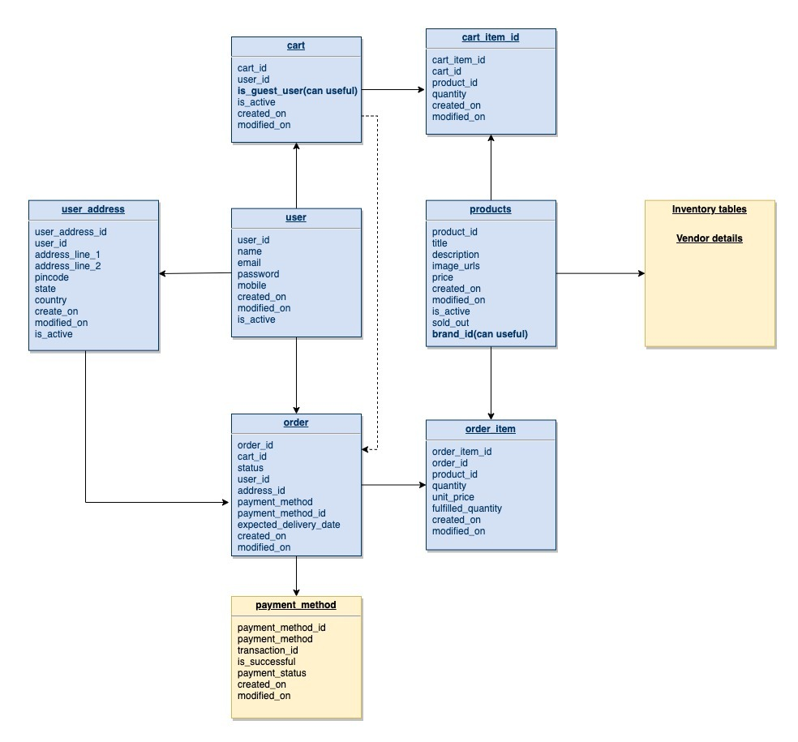

# myos-task
-------------
This is NodeJS + Typscript application, along with Jest setup for TDD. For database we are using postgreSql with minimal DB structure.

### Trasaction management is not handled in this code. Which must atleast during order placement.

Also there are so many edge case handling missing in this repository. As this bare minimum code for understanding.(like for search operation we need elasticSerach or similar approach, All module should be separate microservice considering horizontal scalability etc)

### Note Please create above DB structure and use that credentials in code env file.

##Setup and Prerequisite
* Make sure NPM and Node installed in your system
* git clone this repository and run following command for 1 time setup
* Create .env file on route level and add .env.dev data from config file.
> npm i
* Run following command to start the server on 3000
> npm start
* Run following command for testing
> npm test

## API Endpoints

In this repo not added much code on JWT based user auth. Just for knowledge of middleware implementation we are adding user_id in headers of each request. (We can create different logic for guest user also, - *Not covered here)
So please set following in each request.
>req.headers.user_id={WHAT_EVER_USER_ID_U_CREATED}

1. List all products
> GET /api/products

2. Search product based on title and description
> GET /api/products?q=kids t-shirt

3. Direct product serach
> GET /api/products/{product_id}

4. Add product to cart
> POST api/cart

With body { product_id: 12, quantity: 1}

5. Get cart api
> GET api/cart

6. Place Order
> POST api/orders

with body { address_id: 1, cart_id: 123}

7. Get order list
> GET api/orders

8. Get Order details
> GET api/orders/{order_id}

